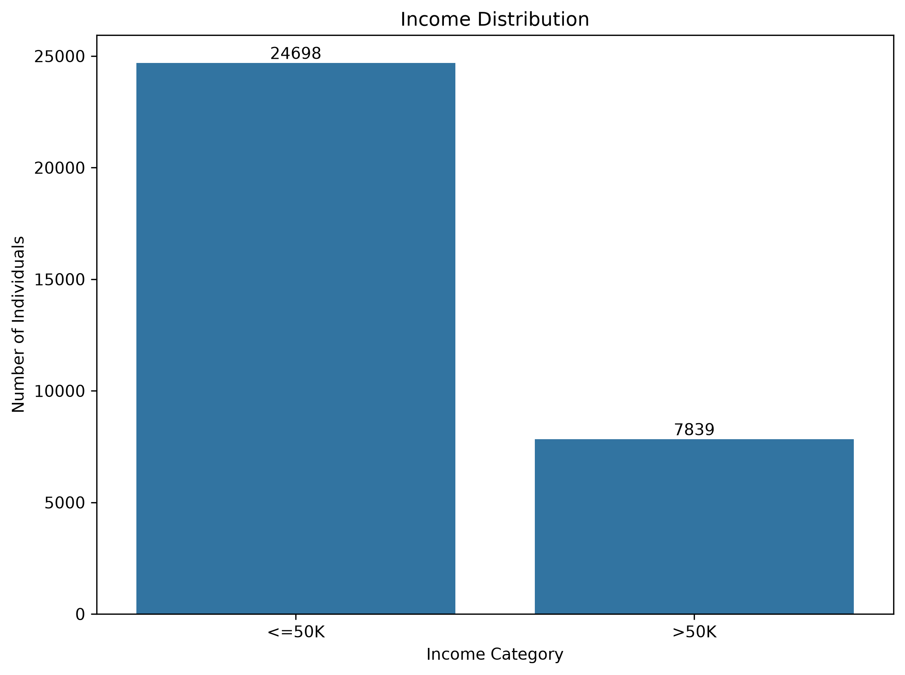

# Adult Income Dataset — Week 2 EDA Report

## 1. Introduction

Week 2 focused on exploratory data analysis of the cleaned Adult Income dataset prepared during Week 1.

The main goal of this analysis was to understand the distribution of important variables, study their relationship with income, identify unusual values, and find patterns that may be useful for the machine-learning stage.

The analysis was performed using Python with Pandas, Matplotlib, and Seaborn.

---

## 2. Dataset Overview

The cleaned dataset contains:

- **Rows:** 32,537
- **Columns:** 15
- **Numerical variables:** 6
- **Categorical variables:** 9

The dataset contains demographic, educational, employment, financial, and income-related information.

The analysis was performed on the cleaned dataset generated during Week 1 rather than modifying the original raw dataset.

---

## 3. Income Distribution

The income variable contains two categories:

- `<=50K`
- `>50K`

The dataset contains:

- **<=50K:** 24,698 individuals (75.91%)
- **>50K:** 7,839 individuals (24.09%)

This shows that the target variable is imbalanced, with the `<=50K` class representing the majority of observations.

This imbalance should be considered during the machine-learning stage.

---

## 4. Age Analysis

The age of individuals ranges from **17 to 90 years**.

- Mean age: **38.59**
- Median age: **37**
- Standard deviation: **13.64**

The largest age group is **26–35**, followed by **36–45** and **18–25**.

The percentage of individuals earning more than 50K generally increases with age up to the 46–55 group.

This suggests that age may have a meaningful relationship with income.

---

## 5. Education vs Income

Education shows a clear relationship with income.

Higher educational qualifications generally have a larger proportion of individuals earning more than 50K.

For example:

- Bachelors: **41.49% >50K**
- Masters: **55.69% >50K**
- Doctorate: **74.09% >50K**
- Prof-school: **73.44% >50K**

Lower education categories have much smaller proportions of individuals in the >50K group.

This indicates that education level is likely to be an important feature for income prediction.

---

## 6. Workclass vs Income

The dataset contains several employment categories including Private, Government, and Self-employed groups.

The `Self-emp-inc` category has a relatively high proportion of individuals earning more than 50K.

Government categories also show a higher >50K proportion compared with some other groups.

The `?` category represents unknown workclass values and should be handled carefully during preprocessing.

---

## 7. Occupation vs Income

Occupation also shows noticeable differences in income distribution.

The highest >50K proportions were observed in:

- Exec-managerial: **48.41%**
- Prof-specialty: **44.92%**
- Protective-serv: **32.51%**
- Tech-support: **30.53%**
- Sales: **26.93%**

In contrast, occupations such as Priv-house-serv and Other-service have much lower >50K proportions.

This suggests that occupation can provide useful information for predicting income.

---

## 8. Marital Status vs Income

Marital status shows a noticeable relationship with income.

The `Married-civ-spouse` category contains the largest number of individuals and has a relatively high >50K proportion of **44.69%**.

Individuals in the `Never-married` category have a much smaller >50K proportion of **4.60%**.

This variable may therefore provide useful predictive information.

---

## 9. Sex vs Income

The income distribution differs between the two recorded sex categories.

- Male: **30.59% >50K**
- Female: **10.96% >50K**

This difference should be considered during feature analysis and model development.

The variable should be handled carefully because differences in historical income patterns may also introduce fairness considerations.

---

## 10. Hours per Week

The dataset shows a wide range of working hours.

The correlation analysis indicates a positive relationship between hours worked per week and income.

The correlation between `hours-per-week` and income is approximately **0.230**.

The IQR analysis also identified a large number of potential outliers in this variable.

These observations should not automatically be removed because unusually high working hours can represent legitimate individuals in the dataset.

---

## 11. Capital Gain and Capital Loss

Both financial variables are highly skewed.

For `capital-gain`:

- Zero values: **29,825**
- Non-zero values: **2,712**

For `capital-loss`:

- Zero values: **31,018**
- Non-zero values: **1,519**

Most observations therefore contain zero values, while a relatively small number contain large values.

The mean capital gain is much higher for individuals earning >50K than for individuals earning <=50K.

These variables may require suitable preprocessing or transformation before machine-learning models are trained.

---

## 12. Numerical Correlation Analysis

The numerical variables examined were:

- age
- fnlwgt
- education-num
- capital-gain
- capital-loss
- hours-per-week

The strongest numerical relationships with income were:

- education-num: **0.335**
- age: **0.234**
- hours-per-week: **0.230**
- capital-gain: **0.223**
- capital-loss: **0.151**

`fnlwgt` showed almost no correlation with income.

The results suggest that education level, age, working hours, and financial variables may be more useful for income prediction than `fnlwgt`.

---

## 13. Outlier Analysis

IQR-based analysis was performed on the numerical variables.

The largest proportion of potential outliers was found in:

- `hours-per-week`: **27.67%**
- `capital-gain`: **8.34%**
- `capital-loss`: **4.67%**
- `education-num`: **3.67%**
- `fnlwgt`: **3.05%**
- `age`: **0.44%**

The high number of potential outliers in `hours-per-week` is partly due to the relatively concentrated distribution around normal working hours.

These values should be investigated rather than automatically removed.

---

## 14. Key Findings

The main observations from Week 2 are:

1. The target variable is imbalanced, with approximately 76% of observations in the <=50K category.
2. Education shows one of the strongest relationships with income.
3. Age is positively associated with higher income up to the older age groups.
4. Occupation shows substantial differences in income distribution.
5. Workclass and marital status also show noticeable income differences.
6. Capital gain and capital loss are strongly right-skewed and contain many zero values.
7. Hours per week contains a relatively large number of IQR-based potential outliers.
8. Unknown categorical values represented by `?` remain important for preprocessing.
9. `fnlwgt` has very weak correlation with the income target.
10. The exploratory analysis provides useful guidance for feature engineering and model preparation.

---

## 15. Week 2 Outcome

The exploratory analysis provided a clearer understanding of the cleaned Adult Income dataset.

Important patterns, class imbalance, skewed financial variables, unknown categorical values, and potential outliers were identified.

These findings will be used in the next stage of the project for feature engineering, encoding, preprocessing, and preparation of the dataset for machine-learning models.

---

## Visualizations

The Week 2 analysis includes the following visualizations:

- Income distribution
- Education vs income
- Occupation vs income
- Age group vs income
- Workclass vs income
- Marital status vs income
- Sex vs income
- Hours per week vs income
- Capital gain vs income
- Capital loss vs income
- Correlation heatmap
- Hours per week outlier analysis
