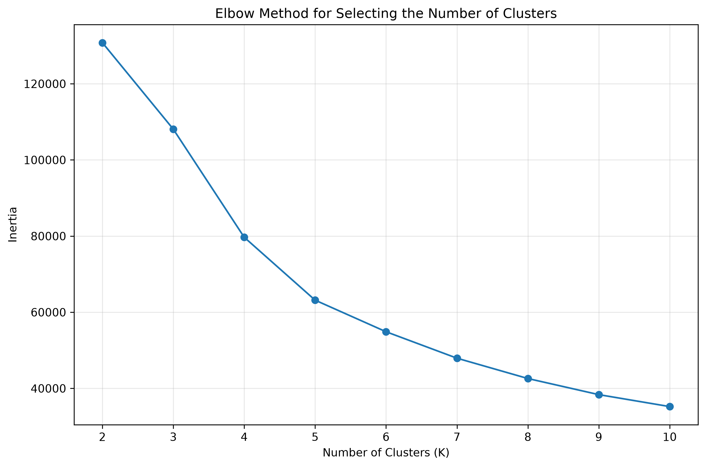
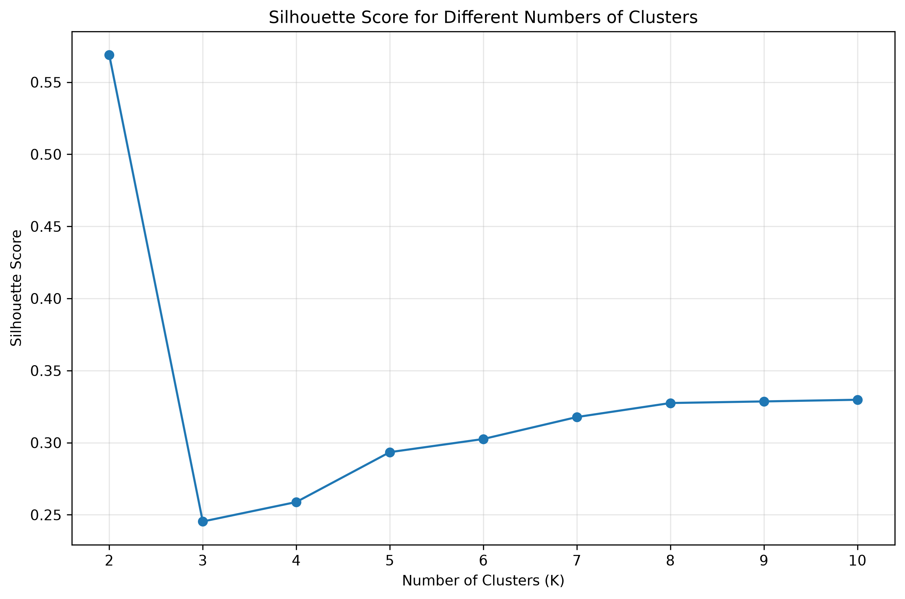
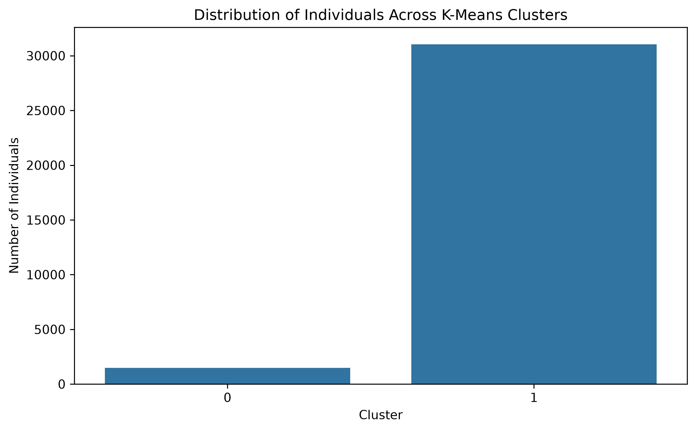
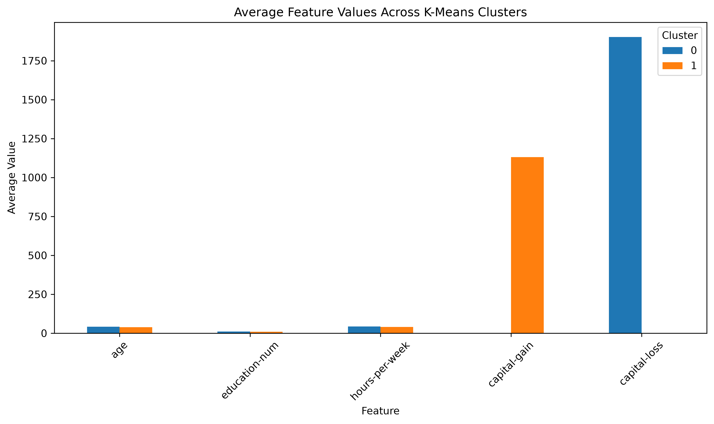
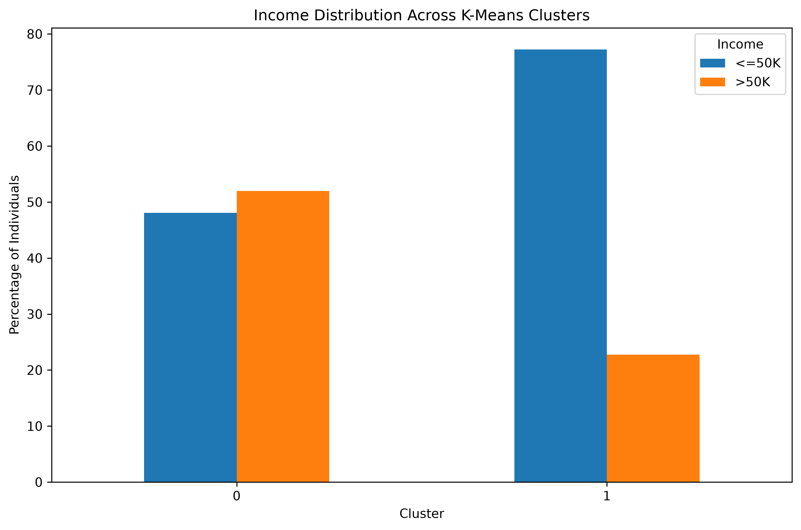
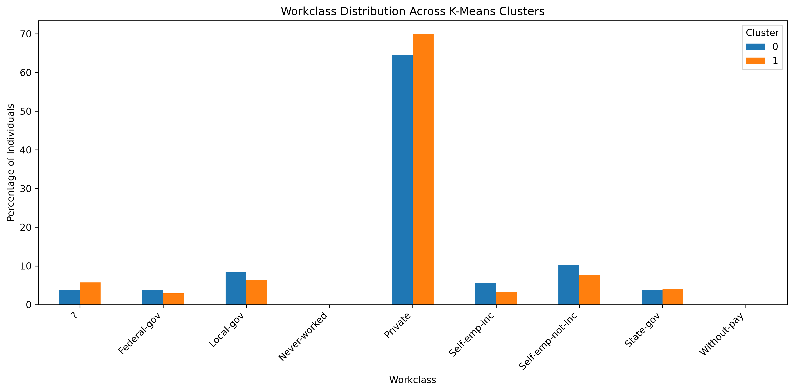
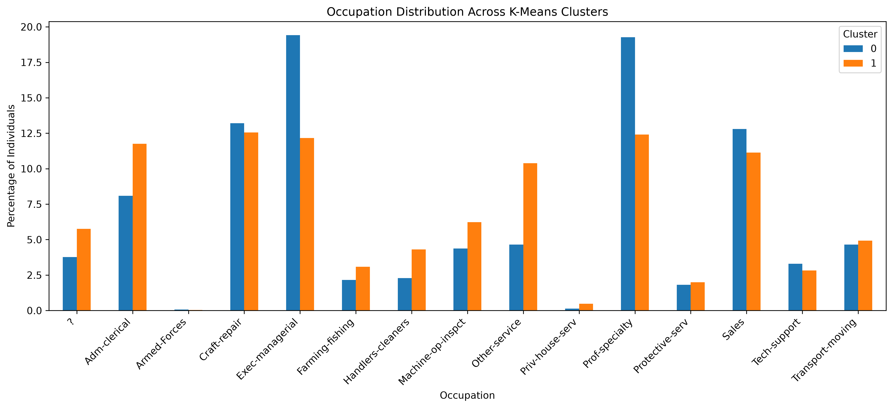
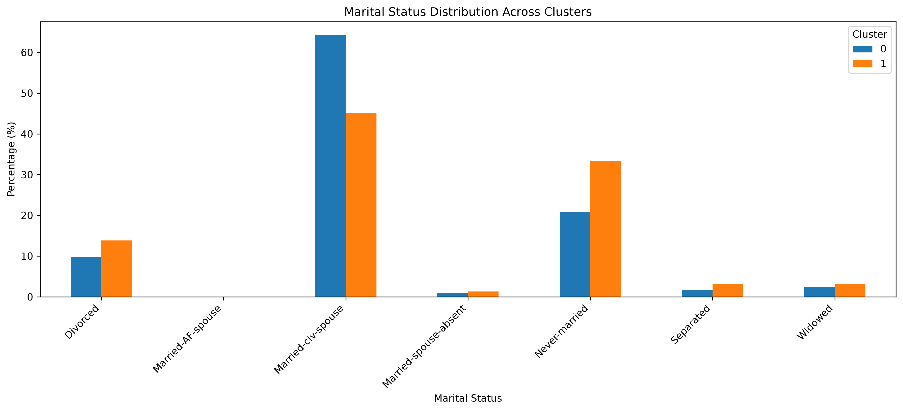
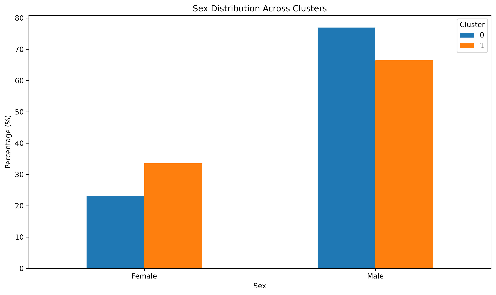
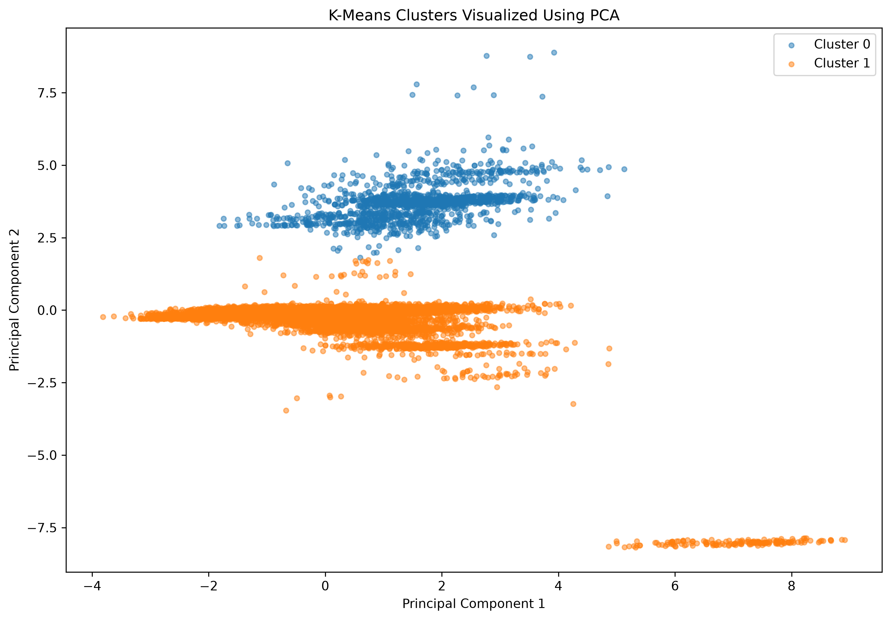

# Week 3 Report — Unsupervised Learning and Clustering

## 1. Introduction

This week focused on applying unsupervised learning techniques to the cleaned Adult Income dataset. The main objective was to identify groups of individuals with similar characteristics without using income as an input variable.

K-Means clustering was selected because it is a commonly used unsupervised learning algorithm for grouping observations based on similarity.

The clustering analysis used the following five numerical features:

- Age
- Education number
- Hours per week
- Capital gain
- Capital loss

Income was intentionally excluded from the clustering inputs. It was analyzed after clustering to understand whether the resulting groups showed different income patterns.

---

## 2. Dataset Used

The analysis was performed using the cleaned Adult Income dataset prepared during the previous weeks.

The dataset contains:

- Total observations: 32,537
- Total columns: 15
- Clustering features: 5

The selected clustering features have different numerical ranges, particularly capital gain and capital loss. Therefore, standardization was performed before applying K-Means.

---

## 3. Data Preparation

The five selected numerical variables were standardized using StandardScaler.

Standardization was necessary because K-Means uses distance calculations to group observations. Without scaling, variables with larger numerical ranges could have a disproportionate influence on the clustering results.

After standardization, the transformed variables had approximately zero mean and unit standard deviation.

---

## 4. Selection of the Number of Clusters

Two methods were used to determine a suitable number of clusters:

1. Elbow Method
2. Silhouette Score

### 4.1 Elbow Method

The Elbow Method was used to examine how the within-cluster sum of squares changed as the number of clusters increased.

The inertia decreases as more clusters are introduced, but the improvement becomes smaller as the number of clusters increases. This method was used as one of the criteria for selecting a reasonable number of clusters.

The Elbow Method was considered together with the Silhouette Score and the interpretability of the resulting groups.

---

### 4.2 Silhouette Score

Silhouette scores were calculated for K values from 2 to 10 using a fixed random sample of 5,000 observations to make the evaluation computationally efficient.

The scores obtained were:

| K | Silhouette Score |
|---|---:|
| 2 | 0.5690 |
| 3 | 0.2453 |
| 4 | 0.2589 |
| 5 | 0.2934 |
| 6 | 0.3026 |
| 7 | 0.3178 |
| 8 | 0.3275 |
| 9 | 0.3286 |
| 10 | 0.3298 |

K = 2 produced the highest silhouette score of 0.5690 among the tested values.

Based on the Elbow Method, Silhouette Score, and the interpretability of the resulting groups, K = 2 was selected for the final K-Means model.

---

## 5. Final K-Means Clustering

A K-Means model with two clusters was fitted using the standardized five numerical features.

The final model used:

- Number of clusters: 2
- Random state: 42
- Number of initializations: 10

### Cluster Size Distribution

The final clustering produced two groups:

- **Cluster 0:** 1,484 individuals, representing 4.56% of the dataset.
- **Cluster 1:** 31,053 individuals, representing 95.44% of the dataset.

Cluster 1 therefore represents the large majority of the observations, while Cluster 0 is a much smaller group.

The large difference in cluster sizes should be considered when interpreting the results because the two groups are not evenly distributed.

---

## 6. Cluster Profile

The average values of the five clustering features were compared between Cluster 0 and Cluster 1.

The profile shows clear differences between the clusters.

Cluster 0 has a higher average age of **41.63 years** compared with **38.44 years** in Cluster 1. Its average education-number is also slightly higher at **10.99** compared with **10.04**.

Cluster 0 works an average of **43.36 hours per week**, compared with **40.30 hours per week** for Cluster 1.

The largest differences appear in the financial variables. Cluster 0 has an average capital loss of **1,901.71**, while Cluster 1 has an average capital loss of only **0.66**.

In contrast, Cluster 1 has an average capital gain of **1,129.98**, while Cluster 0 has an average capital gain of **0.00**.

These differences indicate that the financial variables contribute strongly to the separation between the two clusters.

---

## 7. Income Distribution Across Clusters

Income was not used as an input feature during K-Means clustering. Instead, it was examined after clustering to determine whether the groups identified using numerical characteristics show different income patterns.

The results show a noticeable difference between the two clusters.

In Cluster 0, **51.95%** of individuals have an income above 50K. In Cluster 1, the corresponding proportion is **22.76%**.

This represents a difference of approximately **29.19 percentage points** between the two clusters.

The higher proportion of individuals earning above 50K in Cluster 0 provides an interesting post-clustering observation. However, this should be interpreted as an association within the dataset rather than evidence that cluster membership causes a particular income level.

---

## 8. Workclass Distribution

The workclass distribution was examined to understand whether the two clusters differ in their employment categories.

The percentages show the composition of each cluster rather than the overall frequency of workclass categories. This allows the employment structure of Cluster 0 and Cluster 1 to be compared even though their sizes are very different.

The differences in workclass composition provide additional context for understanding the types of individuals represented by each cluster.

Workclass was not used as a direct input feature for the K-Means algorithm. It was examined after clustering to help interpret the resulting groups.

---

## 9. Occupation Distribution

Occupation provides another useful way to interpret the clusters.

The distribution shows how different occupational categories are represented within Cluster 0 and Cluster 1. Comparing these percentages helps identify whether particular occupations are more common in one cluster than the other.

Occupation should be interpreted together with education, age, working hours, and financial variables because no single characteristic completely explains the differences between the clusters.

Occupation was used for post-clustering interpretation and was not included as one of the five numerical K-Means input features.

---

## 10. Marital Status Distribution

Marital status was analyzed to further understand the demographic characteristics of the clusters.

The percentage distribution shows how different marital-status categories are represented within Cluster 0 and Cluster 1.

Comparing these proportions helps identify whether the clusters have noticeably different demographic compositions.

These differences provide additional context for interpreting the clusters alongside the numerical features and occupational characteristics.

Marital status was not used as an input feature for K-Means and was included only for post-clustering interpretation.

---

## 11. Sex Distribution

The sex distribution was examined to identify demographic differences between the two clusters.

The percentages show the proportion of male and female individuals within each cluster.

Comparing these values helps determine whether the clusters have similar or different demographic compositions.

Sex was not included as an input feature for K-Means. It was used only for post-clustering interpretation.

---

## 12. PCA-Based Cluster Visualization

Principal Component Analysis (PCA) was used to reduce the five-dimensional clustering data into two principal components for visualization.

The first principal component explained **25.93%** of the variance, while the second principal component explained **20.60%**.

Together, PC1 and PC2 explained **46.54%** of the total variance in the standardized clustering data.

The scatter plot provides a two-dimensional representation of the K-Means cluster assignments. It helps visually examine the degree of separation and overlap between Cluster 0 and Cluster 1.

Some overlap between the clusters is expected because the original clustering was performed using five numerical dimensions, while PCA represents the data using only two dimensions.

---

## 13. Final Cluster Characteristics

### Cluster 0

Cluster 0 contains **1,484 individuals**, representing **4.56%** of the dataset.

The group has an average age of **41.63 years**, an average education-number of **10.99**, and an average working time of **43.36 hours per week**.

A major characteristic of this cluster is its high average capital loss of **1,901.71**. The cluster has an average capital gain of **0.00**.

The proportion of individuals earning above 50K in this cluster is **51.95%**, which is considerably higher than the corresponding proportion in Cluster 1.

### Cluster 1

Cluster 1 contains **31,053 individuals**, representing **95.44%** of the dataset.

The average age is **38.44 years**, the average education-number is **10.04**, and the average working time is **40.30 hours per week**.

Unlike Cluster 0, this group has an average capital gain of **1,129.98** and a very low average capital loss of **0.66**.

The proportion of individuals earning above 50K is **22.76%**.

Overall, the two clusters differ most noticeably in their financial variables. Cluster 0 also shows somewhat higher average age, education level, working hours, and high-income representation.

---

## 14. Business and Research Implications

The clustering results can be useful for exploratory analysis of demographic and employment patterns.

From a business perspective, the identified groups could help organizations understand different segments of the workforce based on characteristics such as education, age, working hours, and financial indicators. Such segmentation could support workforce planning, targeted analysis, and further employee or customer research.

From a research perspective, clustering provides a way to discover groups without requiring a predefined target variable. The resulting clusters can be studied further to investigate relationships between demographic characteristics, employment categories, and income levels.

The strong difference in cluster sizes is also important. Cluster 1 represents 95.44% of the dataset, while Cluster 0 represents only 4.56%. Therefore, Cluster 0 can be viewed as a smaller and more distinct group within this dataset rather than an equally sized segment.

The difference in income distribution is also notable. The proportion of individuals earning above 50K is 51.95% in Cluster 0 compared with 22.76% in Cluster 1. This can provide a starting point for further research into the characteristics associated with higher income.

However, the clusters should not be interpreted as definitive social or economic categories. They are mathematical groupings produced from the selected features and depend on the dataset, preprocessing decisions, scaling method, and selected value of K.

---

## 15. Limitations

There are several limitations to this clustering analysis.

First, the final clusters are highly imbalanced, with 95.44% of observations assigned to Cluster 1 and only 4.56% assigned to Cluster 0.

Second, the clustering was performed using only five numerical variables. Other demographic and categorical variables were not used as direct inputs to K-Means.

Third, capital gain and capital loss contain highly skewed values. Although standardization was applied, these financial variables still have a strong influence on the resulting clusters.

Finally, the PCA visualization explains 46.54% of the total variance using two components, meaning that some information from the original five-dimensional data is not visible in the two-dimensional plot.

---

## 16. Conclusion

K-Means clustering was successfully applied to the cleaned Adult Income dataset using five standardized numerical features: age, education-number, hours-per-week, capital-gain, and capital-loss.

The Elbow Method and Silhouette Score were used to evaluate different values of K. The highest silhouette score among the tested values was obtained at K = 2, with a score of 0.5690. Therefore, two clusters were selected for the final analysis.

The resulting clusters were examined using numerical profiles, workclass, occupation, marital status, sex, and income distributions.

Cluster 0 contained 1,484 individuals, while Cluster 1 contained 31,053 individuals. The groups showed noticeable differences in age, education, working hours, capital gain, and capital loss.

Income was analyzed only after clustering. The percentage of individuals earning above 50K was 51.95% in Cluster 0 and 22.76% in Cluster 1, showing a clear difference in income composition between the groups.

PCA was also used to visualize the clusters. The first two principal components together explained 46.54% of the total variance.

Overall, this analysis demonstrates how unsupervised learning can be used to discover patterns and groups in a dataset without directly using the target variable during clustering. The results provide a foundation for further experimentation with alternative clustering algorithms, feature selections, and preprocessing techniques.